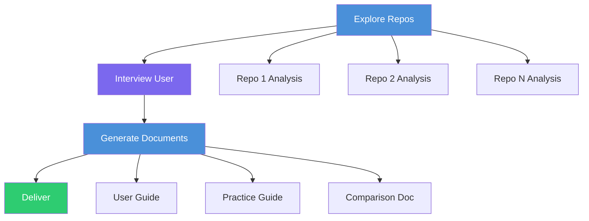

# agent-skill-skill-learner


An agent skill that analyzes agent skill repos and generates structured learning documentation with actionable prompt templates.

## Problem

Agent skills are powerful but opaque. A developer discovers a SKILL.md repo and faces a steep onboarding curve: no usage guide, no prompt templates, no worked examples. Learning requires reading source code line by line, experimenting blindly, and building mental models from scratch.

For repos with multiple skills, the challenge compounds. Which skills work together? What order should they run in? What does the output actually look like? There is no standard way to generate onboarding materials that answer these questions.

Skill-learner closes the gap between "here's a skill repo" and "here's how to use it effectively."

## Features

- **4-stage workflow** -- Explore, Interview, Generate, Deliver -- each stage builds on the previous
- **Parallel repo analysis** -- Spawns subagents to analyze multiple skill repos simultaneously
- **Auto-generated User Guide** -- Installation instructions, per-skill breakdowns, and copy-paste prompt templates with realistic examples (no unfilled placeholders)
- **Practice Guide** -- A fictional but realistic project that exercises every skill in logical order, with expected output samples
- **Multi-repo comparison** -- When analyzing multiple repos, generates a comparison document with feature overlap analysis and scenario recommendations
- **Auto-scaling for large repos** -- Repos with 10+ skills get parallel workstreams instead of a single linear story
- **Customizable output** -- Adapts to developer background, AI tool preference, and prompt language (English, Chinese, or mixed)

## Usage

### Installation

Copy the skill directory to your Claude Code skills location:

```bash
cp -r claude-code-skill-learner/ ~/.claude/skills/skill-learner/
```

The skill activates when you mention learning or analyzing agent skill repos. Trigger phrases include:

- "Learn this skill"
- "Help me understand this skill repo"
- "Analyze these agent skills"
- "Generate a guide for this skill"

### Example Output

The skill generates structured documentation. Here is an excerpt from a typical User Guide showing the per-skill detail format:

> ### Skill: code-reviewer
>
> - **Function**: Analyzes pull requests and provides structured feedback on code quality, patterns, and potential issues
> - **Use Cases**: Before merging PRs, during code review sessions, when onboarding to an unfamiliar codebase
> - **Core Value**: Consistent, thorough review coverage that catches patterns human reviewers miss
> - **How to Invoke**: "Review this PR" or "Analyze the changes in this branch"
> - **Prompt Template**:
>
> ```
> Review the changes in my current branch against main.
> Focus on: error handling, naming consistency, and test coverage gaps.
> Flag any patterns that deviate from the existing codebase style.
> ```

A Practice Guide excerpt showing a step-by-step phase:

```
## Phase 2: Feature Implementation

### Goal
Build the authentication module using the scaffolding from Phase 1.

### Skills Used
- code-generator: Generate auth middleware boilerplate
- code-reviewer: Validate the generated code against security patterns

### Prompt:
Generate an Express.js authentication middleware that uses JWT tokens
with refresh rotation. Follow the project patterns established in
src/middleware/. Include error handling for expired and malformed tokens.

### Expected Output:
// src/middleware/auth.js
const jwt = require('jsonwebtoken');

module.exports = function authenticate(req, res, next) {
  const token = req.headers.authorization?.split(' ')[1];
  if (!token) return res.status(401).json({ error: 'Token required' });
  // ... verification logic with refresh rotation
};
```

## Architecture

The skill operates in four stages, with parallelism in the Explore and Generate phases:



**Stage 1: Explore** -- Parallel subagents scan each repo's structure, SKILL.md files, references, scripts, and dependencies. Reports back skill count, categories, and reference material depth.

**Stage 2: Interview** -- Collects developer requirements in 1-2 efficient question rounds: background, AI tool, coverage scope, output preferences, and prompt language.

**Stage 3: Generate** -- Parallel subagents produce all documents simultaneously. Single repos get a User Guide + Practice Guide. Multiple repos add a Comparison document with feature overlap analysis and decision matrix.

**Stage 4: Deliver** -- Confirms all files are written, presents a summary table, and offers adjustments.
